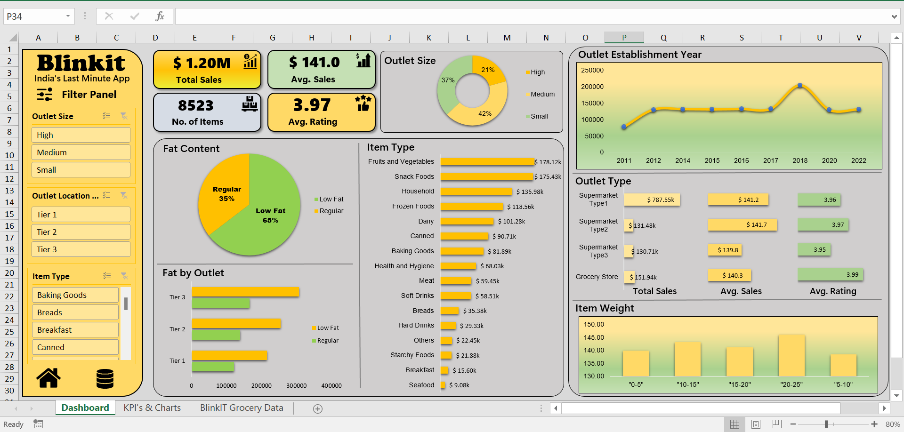

# BlinkIT Grocery Sales Dashboard 📊

An interactive Excel dashboard analyzing sales, ratings, and outlet performance for **BlinkIT** ("India's Last Minute App"), built entirely with native Excel features — pivot tables, formulas, slicers, and charts.

## 📁 Repository Contents

| File | Description |
|---|---|
| `BlinkIT Grocery Dashboard.xlsx` | The complete interactive dashboard workbook (Dashboard, KPI's & Charts, and raw data sheets) |
| `BlinkIT Grocery Data.xlsx` | The raw dataset used to build the dashboard |
| `Dashboard_Screenshot.png` | A preview image of the finished dashboard |

## 📊 About the Dataset

The dataset (`BlinkIT Grocery Data.xlsx`) contains **8,523 records** across **12 columns**:

- **Item Identifier** – unique product ID
- **Item Type** – product category (e.g., Fruits and Vegetables, Snack Foods, Household)
- **Item Fat Content** – Low Fat / Regular
- **Item Weight** – weight of the product
- **Item Visibility** – shelf visibility percentage
- **Outlet Identifier** – unique store ID
- **Outlet Establishment Year** – year the store opened
- **Outlet Size** – Small / Medium / High
- **Outlet Location Type** – Tier 1 / Tier 2 / Tier 3
- **Outlet Type** – Grocery Store / Supermarket Type 1, 2, 3
- **Sales** – sales revenue generated
- **Rating** – customer/store rating

## ✨ Dashboard Features

The `BlinkIT Grocery Dashboard.xlsx` workbook contains three sheets:

1. **Dashboard** – The main visual report, including:
   - **KPI cards**: Total Sales ($1.20M), Average Sales ($141.0), Number of Items (8,523), Average Rating (3.97)
   - **Outlet Size** donut chart (High / Medium / Small split)
   - **Fat Content** pie chart (Low Fat vs. Regular)
   - **Fat by Outlet** breakdown by tier
   - **Sales by Item Type** horizontal bar chart
   - **Outlet Establishment Year** trend line
   - **Outlet Type** performance table (Total Sales, Avg. Sales, Avg. Rating)
   - **Item Weight** distribution chart
   - A **filter panel** with slicers for Outlet Size, Outlet Location Type, and Item Type
2. **KPI's & Charts** – Supporting calculations, pivot tables, and chart source data
3. **BlinkIT Grocery Data** – The raw data feeding the dashboard

## 🛠️ Tools & Techniques Used

- Pivot Tables & Pivot Charts
- Slicers for interactive filtering
- Excel formulas (SUM, AVERAGE, COUNT, etc.)
- Conditional formatting & custom styling
- Donut, pie, bar, and line charts
- Dashboard design principles (KPI cards, color theming, layout)

## 🚀 How to Use

1. Download and open `BlinkIT Grocery Dashboard.xlsx` in Microsoft Excel.
2. Go to the **Dashboard** sheet.
3. Use the **filter panel** on the left (Outlet Size, Outlet Location Type, Item Type slicers) to explore the data interactively.
4. Check the **KPI's & Charts** sheet to see how each visual was built.

## 📌 Key Insights

- Total sales across all outlets amount to **$1.20M**, with an average sale of **$141.0** per item.
- **Low Fat** items account for **65%** of sales vs. **35%** for Regular fat content items.
- **Fruits and Vegetables** and **Snack Foods** are the top-performing item types by sales.
- **Medium**-sized outlets contribute the largest share (**42%**) of sales by outlet size.
- **Grocery Store** outlets post the highest average rating (**3.99**) among outlet types.

---

*This project is intended as a portfolio piece demonstrating Excel dashboarding, data visualization, and business analytics skills.*
